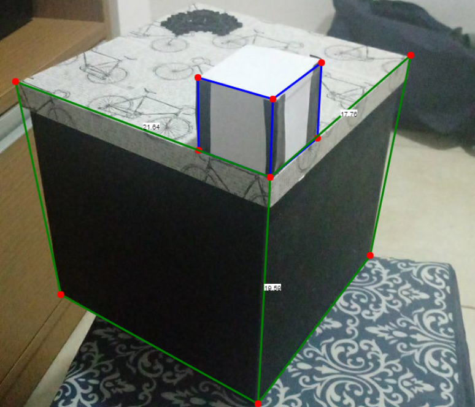
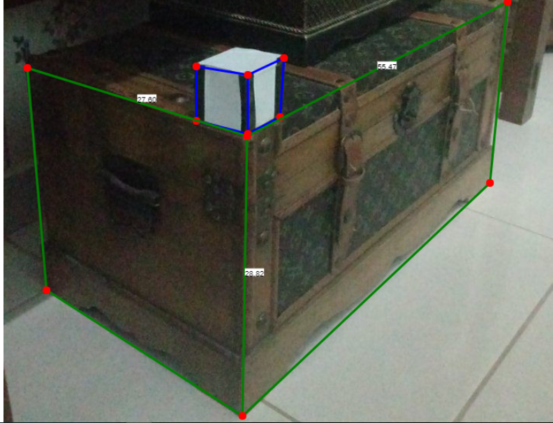

# SVM-TAMI
Single View Metrology application. Cuboid measurements.

## Descrição
A aplicação exibe medidas de objetos cubóides baseado num outro objeto de referência.
## Instruções de uso
* O usuário carrega a imagem desejada que contem um cubo de medidas conhecidas
* O usuário deve ajustar o grid de referência (azul) para o objeto de referência, e informar a medida do lado do cubo
* Em seguida, deve ajustar o grid de medidas (verde) para o objeto em questão

O usuário deverá tomar cuidado com a ordem dos pontos do grid e seus posicionamentos na imagem:
* No grid de referência:
    * O ponto 11 deve estar posicionado na base do objeto, e o eixo 11-01 forma o eixo Z
    * O eixo 11-10 forma o eixo X
    * O eixo 11-12 forma o eixo Y

Os eixos X e Y formam o plano de referência para medidas na direção de Z. De maneira análoga, XZ é o plano de referência para medidas em Y  e YZ para medidas em X.

* No grid de medidas:
    * O ponto 01 deve estar no plano de referência a ser medido. Isto é, se deseja-se fazer uma medida dos 3 lados do cubóide simultaneamente, este deve ser identico ao ponto 11 do grid de referência.
    * O ponto 00, em conjunto com 01, forma a direção X de medida, ou seja, o par 00-01 deve estar alinhado com o eixo 10-11 do grid de referência
    * Analogamente, 01-02 forma a direção Y de medida, enquanto 01-11 forma a direção Z de medida.

A disposição inicial do grid na imagem segue a numeração da imagem. Quando a imagem é carregada, os grids são dispostos nos cantos superior e inferior esquerdo, e podem ser posicionados com o mouse.

Deve-se observar que, quanto maior a deformação projetiva em uma dada direção, temos menos acurácia na medição. Como por exemplo:

,

Neste exemplo, o cubo medido tem 20x20x20cm

Neste exemplo, o baú tem 28x28x55cm

Arquivos de exemplo são fornecidos na pasta testes.

## Dificuldades Encontradas
### Detecção de Pontos de Fuga
Utilizamos o OpenCV para realizar uma detecção de arestas e inferir os pontos de fuga
* Grande número de outliers
    * Arestas que não são arestas de fato
    * Arestas que não pertencem aos eixos desejados
* Alta sensibilidade a parâmetros

Fizemos uso do método RANSAC para encontrar os pontos de fuga
* Grande número de outliers resulta em falsos positivos
* Aumento na quantidade de amostras diminui drasticamente o desempenho do programa

Tentativa de agrupar os pontos de fuga
* Pontos visíveis, usamos distância euclidiana para encontrar um ponto médio
* Pontos no infinito, usamos distância angular

## Em Desenvolvimento
### Detecção de Pontos de Fuga
Fazer um ajuste automático nos métodos do OpenCV que detectam arestas ou realizar uma outra abordagem para encontrar os pontos de fuga automaticamente
### Erros de Medidas
* Cálculo das incertezas associadas a cada medida
* Permitir que o usuário entre com mais de uma medida de referência para aumentar a precisão
### Medições entre Planos
* Cálculo de proporções entre diferentes planos
### Detecção Automática de Objetos
* Detecção de objetos de referência
* Medidas já conhecidas, diminui a entrada do usuário
